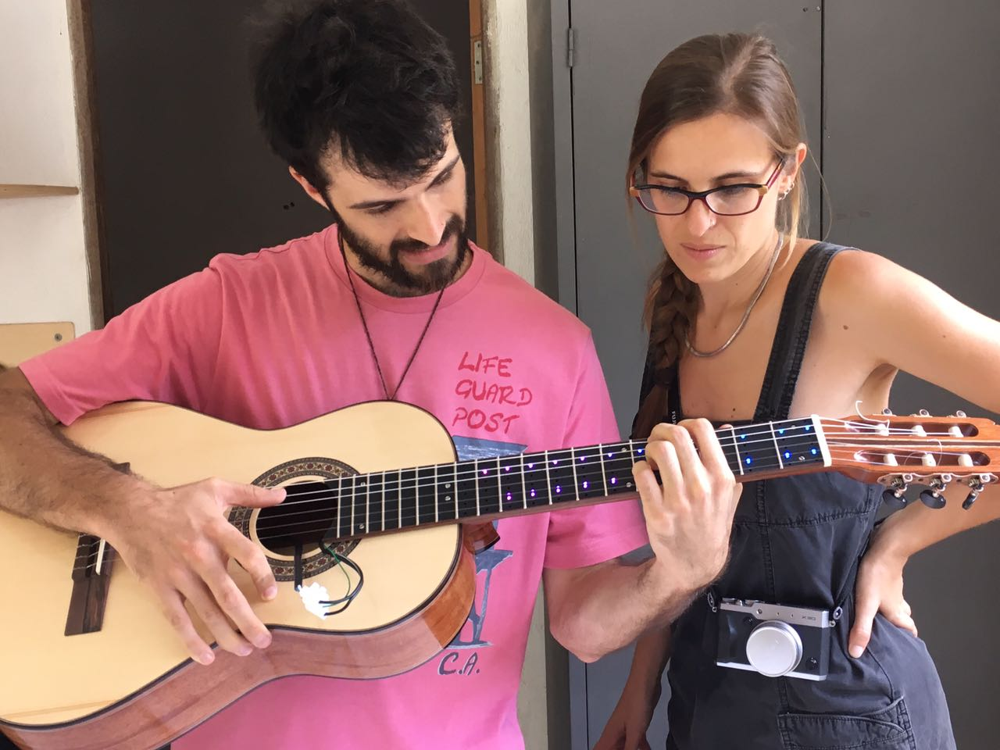
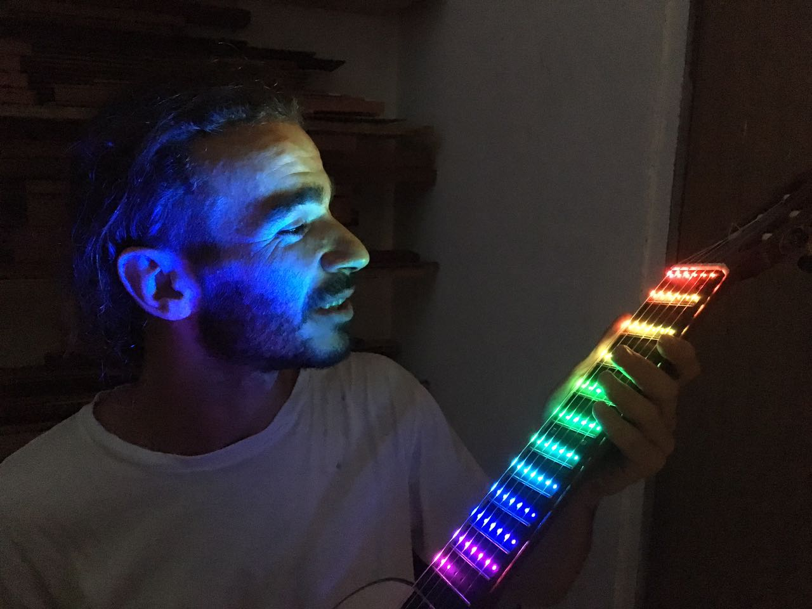
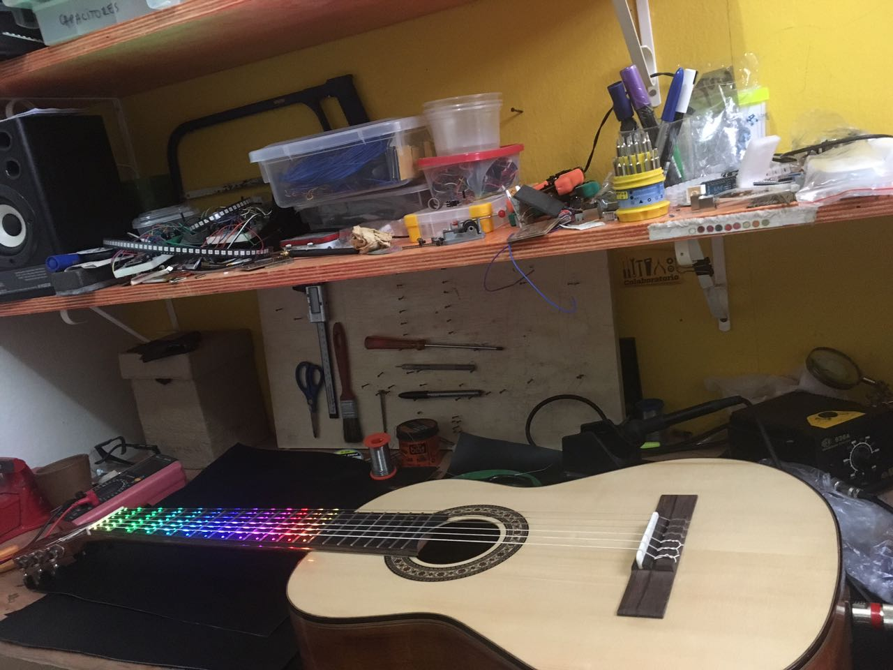
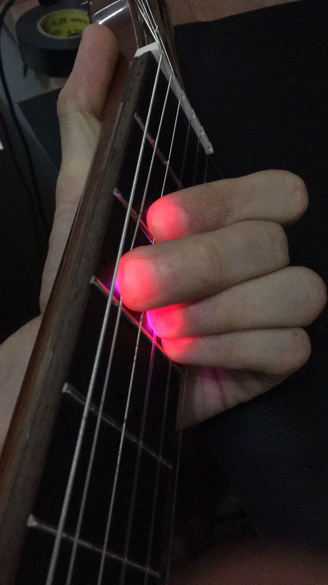
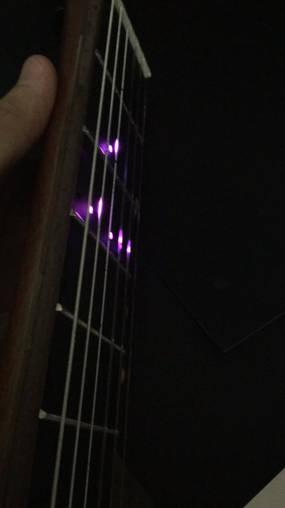

# vioLED
A guitar with LEDs on its frets

This instrument was developed by João Tragtenberg, Filipe Calegario from Batebit Artesania Digital in partnership with the string instruments luthier Rodrigo Veras (https://corpodusom.blogspot.com/) and the company Daccord Music Software as a first prototype for a acoustic guitar connected to a mobile app for educational purpuses.

